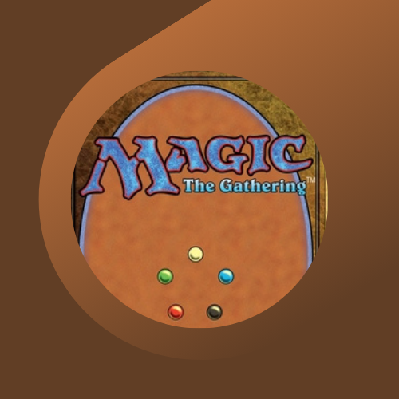

<p align="center">
  <a href="" rel="noopener">
 </a>
</p>

<h3 align="center">MTG Stats API</h3>

<div align="center">

[](https://circleci.com/gh/nestjs/nest)
[](https://www.npmjs.com/~nestjscore)
[]()
[](https://github.com/kylelobo/The-Documentation-Compendium/pulls)
[](https://coveralls.io/github/nestjs/nest?branch=master)
[](/LICENSE)

</div>

---

<p align="center"> MTG Stats API is a backend application developed with NestJS and TypeScript. It is designed to manage Magic: The Gathering games by providing endpoints for authentication, match management, player management, deck management, and statistics. This comprehensive API enables a detailed overview of players' performances and the decks they use.
    <br> 
</p>

## 📝 Table of Contents

- [About](#about)
- [Getting Started](#getting_started)
- [Running the tests](#tests)
- [Deployment](#deployment)
- [Built Using](#built_using)
- [License](#license)
- [Author](#authors)
- [Contact](#contact)

## 🧐 About <a name = "about"></a>

### Description

MTG Stats API is a backend application developed with [NestJS](https://nestjs.com) and TypeScript. It is designed to manage Magic: The Gathering games by providing endpoints for authentication, match management, player management, deck management, and statistics. This comprehensive API enables a detailed overview of players' performances and the decks they use.

### Key Features

- **Authentication:** Register, sign in, sign out, and refresh tokens for secure access.
- **Match Management:** Create, update, retrieve, and delete matches, including details such as decks used, game format, duration, result, and match date.
- **Player Management:** Register, retrieve, update, and delete players, along with providing detailed player statistics.
- **Deck Management:** Create, retrieve, update, and delete decks, allowing association with specific players.
- **Statistics:** Generate performance analysis including win rate, matchup history, deck comparisons, and a leaderboard.
- **External API Integration:** Leverage Supabase for data management and authentication, and Scryfall API for card information.
- **Robust Testing Environment:** Extensive unit and end-to-end tests ensure the reliability of all endpoints.

### Technologies Used

- **Backend:** Node.js, NestJS, TypeScript
- **Database & Authentication:** Supabase
- **External API:** Scryfall API
- **Testing:** Jest, Supertest
- **Documentation:** Swagger (accessible at `/api`)

## 🏁 Getting Started <a name = "getting_started"></a>

These instructions will get you a copy of the project up and running on your local machine for development and testing purposes. See [deployment](#deployment) for notes on how to deploy the project on a live system.

### Prerequisites

- [Node.js](https://nodejs.org/docs/latest/api/) (LTS version recommended)
- [NPM](https://docs.npmjs.com/node) (usually bundled with Node.js)
- A [Supabase](https://supabase.com/docs) account and proper configuration of environment variables (e.g., `SUPABASE_URL` and `SUPABASE_SERVICE_ROLE_KEY`)


### Installing

Clone the repository and install the dependencies:

```
git clone <https://github.com/ghiberti85/mtg-stats-api>
cd mtg-stats-api
npm install
```

Create a .env file at the root of the project with the following variables (example):

```
SUPABASE_URL=https://yourproject.supabase.co
SUPABASE_SERVICE_ROLE_KEY=your-service-role-key
PORT=3000
```
To start the application in development mode:

```
npm run start:dev
```
The API will be available at http://localhost:3000.

### API Documentation

Interactive API documentation is automatically generated using Swagger and is accessible at:

http://localhost:3000/api

This interface provides detailed information on all endpoints, request/response models, and allows you to test the API directly from your browser.

## 🔧 Running the tests <a name = "tests"></a>


### Unit Tests

We are using [Jest](https://jestjs.io/docs/getting-started) for unit tests

- Run unit tests with:

```
npm run test
```

### End-to-End (E2E) Tests

- Run E2E tests with:

```
npm run test:e2e
```

### Test Coverage Reports

- Unit Test Coverage

```
npm run test:cov
```

- E2E Test Coverage

```
npm run test:e2e:cov
```
Coverage reports help identify areas for improvement and ensure critical application flows are thoroughly tested.

## 🚀 Deployment <a name = "deployment"></a>

For production deployment, follow the [NestJS Deployment Documentation](https://docs.nestjs.com/deployment) to optimize your application.

You can also use platforms like Mau for a streamlined deployment process on AWS.

## ⛏️ Built Using <a name = "built_using"></a>

- [Supabase](https://supabase.com/docs) - Databases, Authentication, and Storage
- [NodeJs](https://nodejs.org/en/) - Server Environment
- [NestJS](https://nestjs.com) - Server Framework
- [Jest](https://jestjs.io/) - Testing Framework

## 📄 License <a name = "license"></a>

This project is licensed under the [MIT License](https://github.com/nestjs/nest/blob/master/LICENSE).

## ✍️ Authors <a name = "authors"></a>

Developed with 💚 by [@ghiberti85](https://github.com/ghiberti85)

## 👋 Contact <a name = "contact"></a>

- [Website](https://fernando-ghiberti.vercel.app)
- [LinkedIn](https://linkedin.com/in/fernando-ghiberti)


